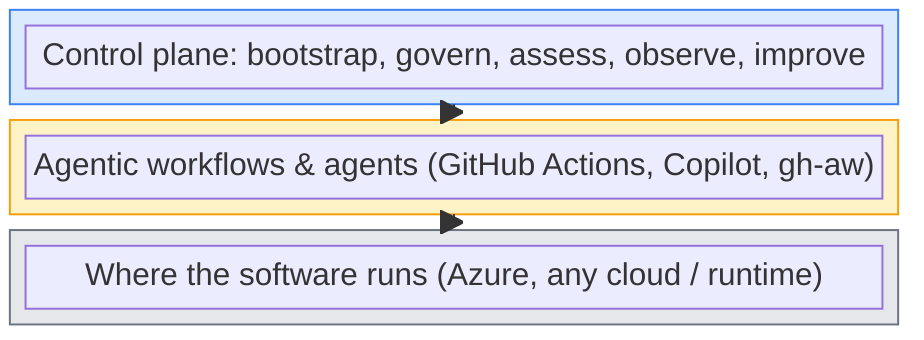
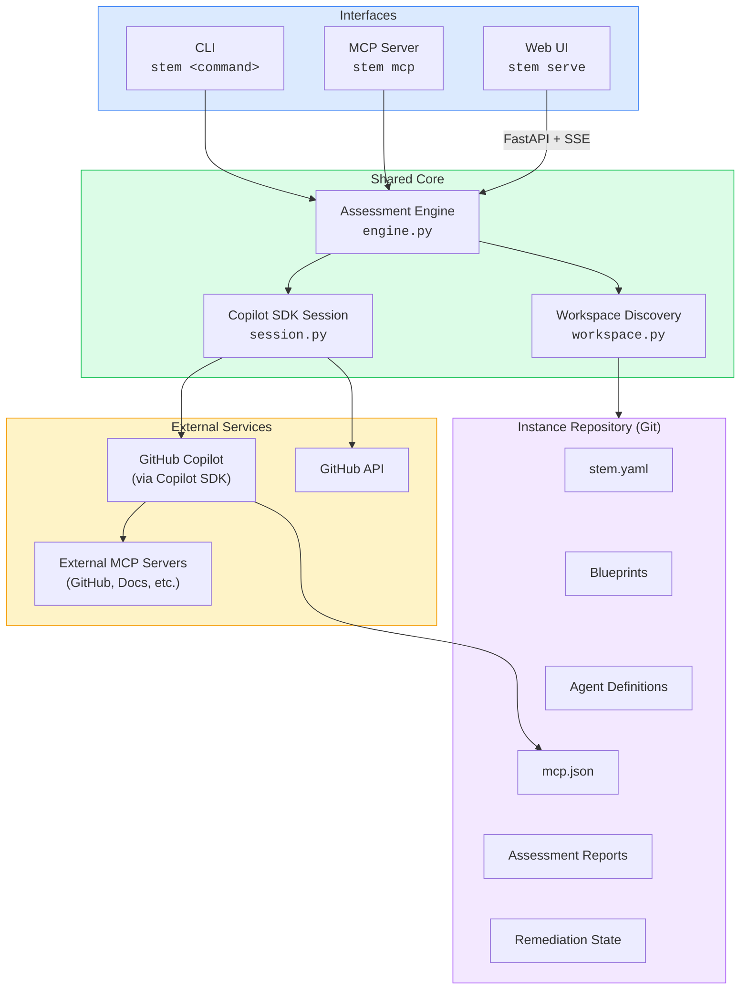
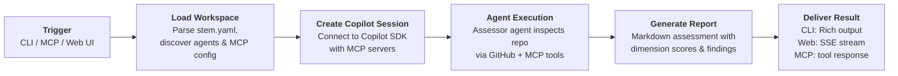
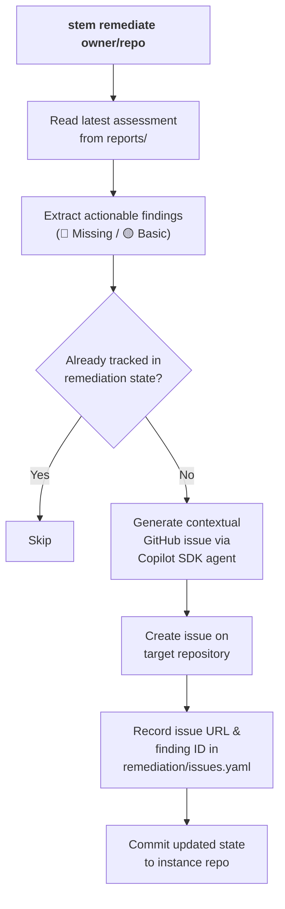
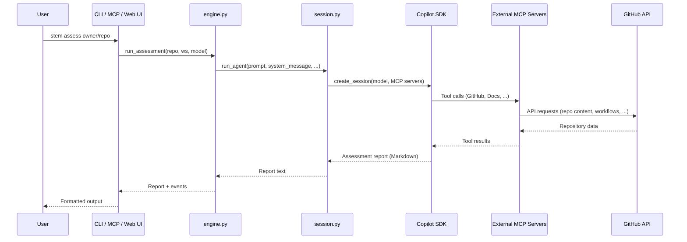
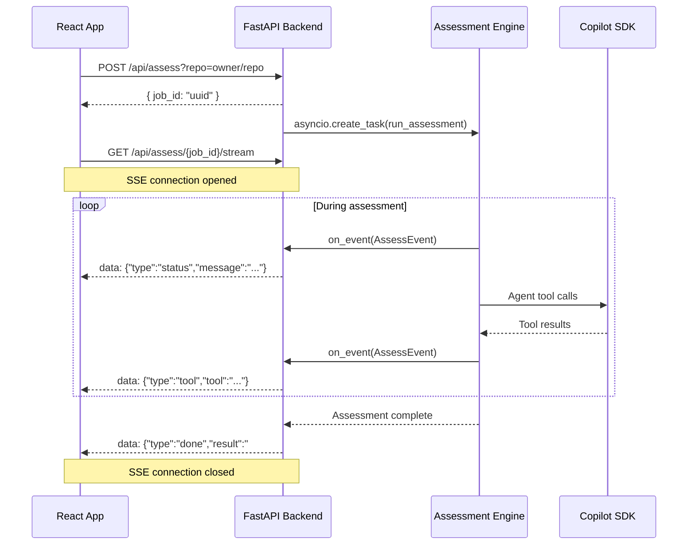
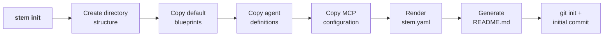
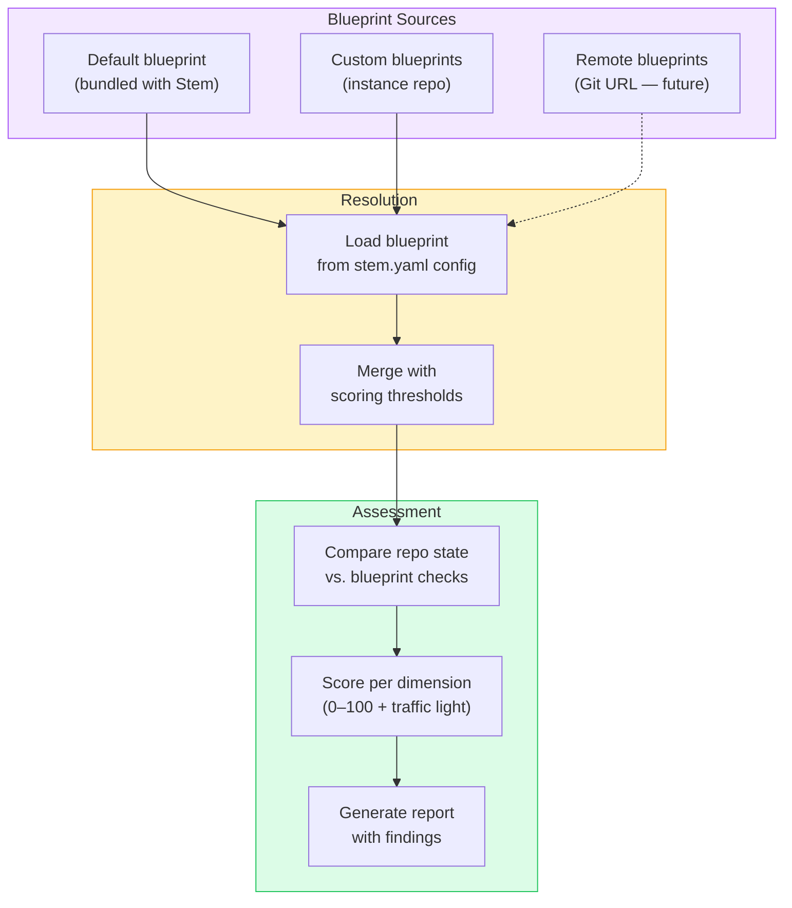
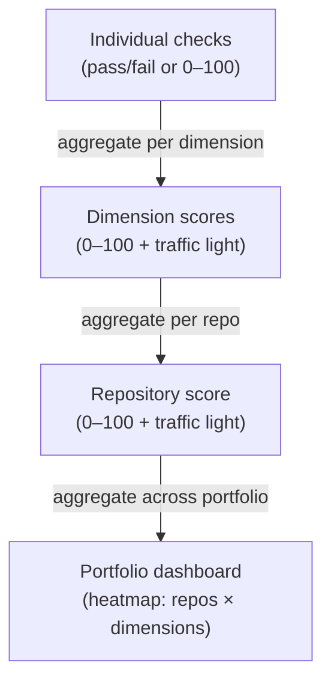
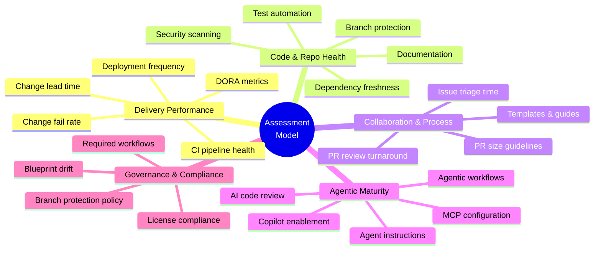

# Architecture

This document describes the high-level architecture of HVE Stem — the control
plane for agentic software development. It covers the layered model, component
responsibilities, data flows, and module boundaries.

For the full design narrative and assessment model, see
[NARRATIVE.md](NARRATIVE.md). For individual design decisions, see the
[ADRs](docs/adr/).

---

## Three-Layer Model

Stem operates within a three-layer model. Only Layer 1 is part of this project:



- **Layer 1 (Stem):** What we are building. Manages and improves Layers 2
  and 3 configurations.
- **Layer 2 (Substrate):** The agentic workflows running on GitHub. Stem
  configures and assesses these but does not replace them.
- **Layer 3 (Runtime):** The deployment target for software produced by the
  Layer 2 SDLC. Stem may read Layer 3 state to verify that Layer 2
  configured it correctly.

---

## Component Diagram

Stem exposes three interfaces — CLI, MCP server, and Web UI — all built on
top of a shared core engine:



---

## Module Map

All Python source lives under `src/stem/`:

| Module               | Responsibility                                                                   |
|----------------------|----------------------------------------------------------------------------------|
| `cli.py`             | Typer application entry point; workspace initialisation; command registration     |
| `engine.py`          | Shared assessment engine — the single implementation that CLI, MCP, and web call |
| `session.py`         | Copilot SDK session management — creates sessions, loads MCP configs, runs agent |
| `workspace.py`       | Discovers skills, agents, targets, and other artefacts from the instance repo    |
| `commands/init.py`   | `stem init` — scaffolds a new instance repository with blueprints and config     |
| `commands/assess.py` | `stem assess` — CLI wrapper around the engine with Rich progress output          |
| `commands/serve.py`  | `stem serve` — FastAPI app with REST + SSE endpoints, serves the React SPA       |
| `commands/mcp.py`    | `stem mcp` — MCP server exposing `assess_repo` tool for coding agents            |

---

## Assessment Pipeline

The `stem assess` command triggers a multi-step pipeline that evaluates a
repository against the desired SDLC blueprint:



### Step-by-step

1. **Trigger:** The user invokes `stem assess owner/repo` via CLI, the Web UI
   assess form, or the `assess_repo` MCP tool.
2. **Load workspace:** The `Workspace` is loaded from the instance repository,
   parsing `stem.yaml` for targets/config and discovering agent files and MCP
   server configuration.
3. **Create Copilot session:** A `CopilotClient` session is created via the
   Copilot SDK with the configured model (default: `claude-sonnet-4.6`) and
   external MCP servers (GitHub, Microsoft Docs, etc.).
4. **Agent execution:** The assessor agent receives a prompt to evaluate the
   target repository. It uses MCP tools to inspect repo contents, workflows,
   configuration files, and community health files.
5. **Generate report:** The agent produces a comprehensive Markdown assessment
   covering delivery performance, code health, collaboration, agentic maturity,
   and governance compliance.
6. **Deliver result:** The report is returned to the originating interface —
   Rich console output for CLI, SSE-streamed events for Web UI, or a direct
   tool response for MCP.

---

## Remediation Pipeline

Assessment findings feed into the remediation pipeline, which creates
actionable GitHub issues on target repositories:



Key properties:

- **Idempotent** — re-running does not create duplicate issues.
- **Contextual** — issues reference actual file paths and configurations.
- **Tracked** — remediation state in `remediation/<owner>/<repo>/issues.yaml`
  links findings to GitHub issues.

---

## Request Lifecycle

All three interfaces share the same core path. The differences are only in how
the request enters and how the result is delivered:



---

## SSE Streaming (Web UI)

The Web UI uses Server-Sent Events to stream real-time progress from the
FastAPI backend to the React frontend:



### Frontend architecture

The React frontend (in `app/`) is built with Vite and uses the GitHub Primer
design system:

| Directory            | Contents                                                    |
|----------------------|-------------------------------------------------------------|
| `app/src/pages/`     | Route-level components — `AssessPage`, `RemediatePage`      |
| `app/src/components/`| Shared UI — `AppHeader`, `EventLog`, `MarkdownReport`      |
| `app/src/api/`       | API client (`client.ts`), SSE hook (`useAssess.ts`), types  |

The `useAssess` React hook encapsulates the full assess flow: it calls
`POST /api/assess` to start a job, then opens an `EventSource` on
`/api/assess/{jobId}/stream` to receive real-time events until the
assessment completes.

---

## Init / Bootstrap Flow

`stem init` scaffolds a new instance repository with the directory structure,
configuration, and default blueprints that Stem needs to operate:



The resulting instance repository structure:

```text
my-stem/
├── stem.yaml                    # Instance configuration (targets, scoring)
├── README.md                    # Generated README
├── stem/
│   ├── mcp.json                 # MCP server configuration
│   └── agents/
│       └── assessor.agent.md    # Assessment agent system prompt
├── blueprints/
│   └── default.md               # Default SDLC blueprint
├── reports/                     # Assessment reports (populated by stem assess)
├── remediation/                 # Remediation state (populated by stem remediate)
└── .github/
    ├── agents/                  # Custom agent definitions
    ├── skills/                  # Copilot skills
    └── prompts/                 # Reusable prompts
```

---

## Blueprint & Policy Resolution

Blueprints define the desired SDLC state for target repositories. During
assessment, the engine compares the actual repository state against the
blueprint's expectations:



Blueprint sourcing follows [ADR-0006](docs/adr/adr-0006-blueprint-sourcing-strategy.md):
blueprints are copied into the instance repo at `stem init` time. Future
versions may support pulling blueprints from a remote Git repository.

---

## Scoring & Aggregation

Assessment results roll up from individual checks to a portfolio-level view:



Traffic-light thresholds (configurable per blueprint):

| Colour | Meaning                                               | Default |
|--------|-------------------------------------------------------|---------|
| 🟢     | Healthy — meets or exceeds blueprint expectations     | ≥ 80%   |
| 🟡     | Needs attention — partial compliance or degrading     | 50–79%  |
| 🔴     | Action required — significant gaps or violations      | < 50%   |

---

## Assessment Dimensions

The assessment model organises checks into five dimensions, each grounded in
established research frameworks:



| Dimension                      | Framework basis                | Stem-specific?   |
|--------------------------------|--------------------------------|------------------|
| Delivery Performance           | DORA                           | No               |
| Code & Repo Health             | SPACE (Performance) + DevEx    | No               |
| Collaboration & Process        | SPACE (Communication) + DevEx  | No               |
| Agentic Maturity               | —                              | **Yes** (unique) |
| Governance & Policy Compliance | —                              | **Yes** (unique) |

---

## Technology Stack

| Layer        | Technology                                                          |
|--------------|---------------------------------------------------------------------|
| **Language** | Python 3.12, TypeScript                                             |
| **CLI**      | Typer + Rich                                                        |
| **AI**       | GitHub Copilot SDK                                                  |
| **Backend**  | FastAPI + Uvicorn                                                   |
| **Frontend** | React 19, Primer Design System (`@primer/react`), Vite              |
| **MCP**      | `mcp` Python SDK (`FastMCP`)                                        |
| **Testing**  | pytest, mypy, Vitest, React Testing Library                         |
| **Linting**  | Ruff (format + lint)                                                |
| **Build**    | hatchling (Python), Vite (frontend)                                 |
| **CI/CD**    | GitHub Actions                                                      |
